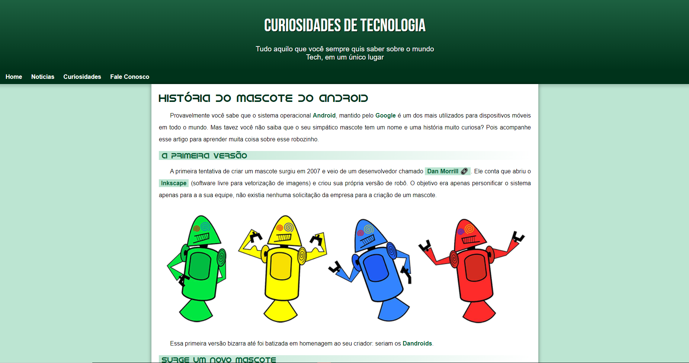

<h1 align="center"> Android Site </h1>

Site exclusivo e gratuito, promovido pelo Curso em Video para ensino de tecnologias WEB.  

  <a href="#-tecnologias">Tecnologias</a>&nbsp;&nbsp;&nbsp;|&nbsp;&nbsp;&nbsp;
  <a href="#-projeto">Projeto</a>&nbsp;&nbsp;&nbsp;|&nbsp;&nbsp;&nbsp;
  <a href="#memo-licença">Licença</a>

  

 

  

## 🚀 Tecnologias

Esse projeto foi desenvolvido com as seguintes tecnologias:

- HTML e CSS
- JavaScript
- Git e Github
- GIMP

## 💻 Projeto

O Site Android é uma página que conta a história inicial por trás do mascote do Android.

- [Visite o projeto online](https://www.youtube.com/watch?v=Ejkb_YpuHWs&list=PLHz_AreHm4dkZ9-atkcmcBaMZdmLHft8n)

## :memo: Licença

Esse projeto está sob a licença MIT.